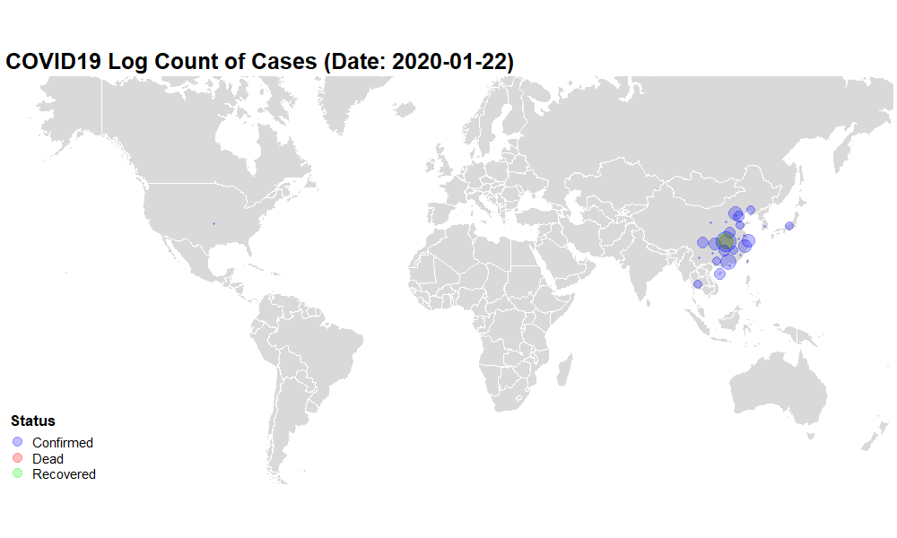

```{r Setup, echo=FALSE, message=FALSE, warning=FALSE, include=FALSE}
# Interaction
library(rvest)
library(rstudioapi)
library(drat)
library(git2r)

# Aggregation
library(readr)
library(tidyr)
library(dplyr)
library(DT)

# Visualizations
library(ggplot2)
library(leaflet)
library(ggthemes)
library(gganimate)
library(maps)
library(png)
library(gifski)
```


```{r, echo=FALSE, message=FALSE, warning=FALSE, results='hide'}
link <- "https://github.com//CSSEGISandData/COVID-19/raw/master/csse_covid_19_data/csse_covid_19_time_series/"
csv_list <- c(
  "time_series_19-covid-Confirmed.csv",
  "time_series_19-covid-Deaths.csv",
  "time_series_19-covid-Recovered.csv"
)


for (csv in csv_list) {
  path <- paste(link, csv, sep = "")
  download_path <- paste("data_raw/", csv, sep = "")
  download.file(path, destfile = download_path)
}
```

```{r, echo=FALSE, message=FALSE, warning=FALSE}
cv_con <- read_csv("data_raw/time_series_19-covid-Confirmed.csv") %>%
  gather(key = "Date", value = Confirmed, -Lat, -Long, -`Province/State`, -`Country/Region`)

cv_ded <- read_csv("data_raw/time_series_19-covid-Deaths.csv") %>%
  gather(key = "Date", value = Dead, -Lat, -Long, -`Province/State`, -`Country/Region`)

cv_rec <- read_csv("data_raw/time_series_19-covid-Recovered.csv") %>%
  gather(key = "Date", value = Recovered, -Lat, -Long, -`Province/State`, -`Country/Region`)
```


```{r, echo=FALSE, message=FALSE, warning=FALSE}
cv_merge <- merge(cv_con, cv_ded, by = c("Province/State", "Lat", "Long", "Country/Region", "Date"), all = TRUE) %>%
  merge(cv_rec, by = c("Province/State", "Lat", "Long", "Country/Region", "Date"), all = TRUE) %>%
  rename("Country_Region" = "Country/Region") %>%
  rename("Province_State" = "Province/State")
cv_merge$Date <- as.Date(cv_merge$Date, format = "%m/%d/%y")

cv <- gather(cv_merge, key = "Status", value = Count, -Date, -Lat, -Long, -Province_State, -Country_Region)
cv <- cv[with(cv, order(Country_Region, Province_State, Status, Date)), ]
```


```{r, echo=FALSE, message=FALSE, warning=FALSE}
check_continuous <- function(x, cv, num_prev) {
  if (
    (cv$Long[x] != cv$Long[x - num_prev]) ||
      (cv$Lat[x] != cv$Lat[x - num_prev]) ||
      (cv$Status[x] != cv$Status[x - num_prev])) {
    cont <- "N"
  }
  else {
    cont <- "Y"
  }
  return(cont)
}


daily_weekly_counter <- function(cv) {
  for (x in seq(1, nrow(cv))) {
    if (x == 1) {
      cv$Daily_Count[x] <- NA
      cv$Weekly_Count[x] <- NA
    }
    else if (check_continuous(x, cv, 1) == "N") {
      cv$Daily_Count[x] <- NA
      cv$Weekly_Count[x] <- NA
    }
    else if (x <= 7) {
      cv$Daily_Count[x] <- (cv$Count[x]) - (cv$Count[x - 1])
      cv$Weekly_Count[x] <- NA
    }
    else if ((check_continuous(x, cv, 1) == "Y") &&
      (check_continuous(x, cv, 7) == "N")) {
      cv$Daily_Count[x] <- (cv$Count[x]) - (cv$Count[x - 1])
      cv$Weekly_Count[x] <- NA
    }
    else if ((check_continuous(x, cv, 7) == "Y")) {
      cv$Daily_Count[x] <- (cv$Count[x]) - (cv$Count[x - 1])
      cv$Weekly_Count[x] <- (cv$Count[x]) - (cv$Count[x - 7])
    }
  }
  return(cv)
}
```


```{r, echo=FALSE, message=FALSE, warning=FALSE}
cv <- daily_weekly_counter(cv)
latest_date <- sort(cv$Date, decreasing = TRUE)[1] - 1
```

#### Latest Date of Dataset: `r latest_date`
##### Updated: `r Sys.time()` EST

```{r, echo=FALSE, message=FALSE, warning=FALSE}
empty_df <- function() {
  empty_df <- data.frame(
    Province_State = character(0),
    Lat = double(), Long = double(),
    Country_Region = character(0),
    Date = as.Date(character()),
    Status = character(0),
    Count = double(),
    Daily_Count = double(), Weekly_Count = double()
  )
  empty_df$Province_State <- as.character(empty_df$Province_State)
  empty_df$Country_Region <- as.character(empty_df$Country_Region)
  empty_df$Status <- as.character(empty_df$Status)
  return(empty_df)
}
```


```{r, echo=FALSE, message=FALSE, warning=FALSE}
first_and_new_cases <- function(cv, days) {
  high_date <- sort(cv$Date, decreasing = TRUE)[1] - 1
  cv <- filter(cv, Status == "Confirmed")
  cv$First_Case <- FALSE

  for (x in seq(1, nrow(cv))) {
    if (
      (cv$Date[x] == high_date) &&
        (cv$Count[x - days] == 0) &&
        (cv$Count[x] > 0)
    ) {
      cv$First_Case[x] <- TRUE
    }
  }

  new_cases_df <- filter(cv, Date == high_date)

  if (days == 1) {
    new_cases_df <- filter(new_cases_df, Daily_Count > 0)
  }
  else if (days == 7) {
    new_cases_df <- filter(new_cases_df, Weekly_Count > 0)
  }

  return(new_cases_df)
}

new_cases_day <- first_and_new_cases(cv, 1)
new_cases_week <- first_and_new_cases(cv, 7)
```

```{r, echo=FALSE, warning=FALSE}
first_color <- colorFactor(palette = c("red", "blue"), levels = c(TRUE, FALSE))

new_day_labels <- function(df) {
  labs <- lapply(seq(nrow(df)), function(i) {
    paste0(
      "Country: ", df[i, "Country_Region"], "<br> ",
      "Province: ", df[i, "Province_State"], "<br>",
      "Day Count: ", df[i, "Daily_Count"], "<br>",
      "First Case: ", df[i, "First_Case"], "<br>",
      "Date: ", df[i, "Date"]
    )
  })
}

leaflet(data = new_cases_day, width = "100%") %>%
  addTiles() %>%
  addCircleMarkers(
    lat = ~Lat,
    lng = ~Long,
    radius = ~ log(Count) / 1.25,
    label = lapply(new_day_labels(new_cases_day), htmltools::HTML),
    color = ~ first_color(First_Case)
  ) %>%
  addLegend("bottomright",
    pal = first_color, values = ~First_Case,
    title = "First Case (Day)",
    opacity = 0.75
  )
```

```{r, echo=FALSE}
df_new_cases_day <- new_cases_day %>%
  select(
    Date, Country_Region, Province_State,
    Count, Daily_Count, Weekly_Count, First_Case
  )
df_new_cases_day
```


```{r, echo=FALSE}
first_color <- colorFactor(palette = c("red", "blue"), levels = c(TRUE, FALSE))

new_week_labels <- function(df) {
  labs <- lapply(seq(nrow(df)), function(i) {
    paste0(
      "Country: ", df[i, "Country_Region"], "<br> ",
      "Province: ", df[i, "Province_State"], "<br>",
      "Week Count: ", df[i, "Weekly_Count"], "<br>",
      "First Case: ", df[i, "First_Case"], "<br>",
      "Date: ", df[i, "Date"]
    )
  })
}

leaflet(data = new_cases_week, width = "100%") %>%
  addTiles() %>%
  addCircleMarkers(
    lat = ~Lat,
    lng = ~Long,
    radius = ~ log(Count) / 1.25,
    label = lapply(new_week_labels(new_cases_week), htmltools::HTML),
    color = ~ first_color(First_Case)
  ) %>%
  addLegend("bottomright",
    pal = first_color, values = ~First_Case,
    title = "First Case (Week)",
    opacity = 0.75
  )
```

```{r, echo=FALSE}
df_new_cases_week <- new_cases_week %>%
  select(
    Date, Country_Region, Province_State,
    Count, Daily_Count, Weekly_Count, First_Case
  )
df_new_cases_week
```


```{r, echo=FALSE, message=FALSE, warning=FALSE, error=False, results='hide', include=FALSE}
p <- ggplot() +
  borders("world", colour = "white", fill = "gray85") +
  coord_map(xlim = c(-180, 180), ylim = c(-55, 70)) +
  theme_map() +
  geom_point(data = filter(cv, Date<=latest_date), aes(x = Long, y = Lat, size = log(Count), color = Status), alpha = 0.25) +
  scale_size_continuous(range = c(1, 15)) +
  scale_color_manual(values = c("blue", "red", "green")) +
  labs(title = "Date: {frame_time}", size = "Log(Cases)") +
  theme(
    plot.title = element_text(size =25, face = "bold"),
    legend.text = element_text(size = 15),
    legend.title = element_text(size = 17, face = "bold")
  ) +
  guides(color = guide_legend(override.aes = list(size = 5))) +
  transition_time(Date) +
  enter_fade() +
  exit_fade() +
  ease_aes("linear")

days = as.numeric(latest_date - as.Date("2020-01-22"))

anim_save("covid19_timelapse.gif", p, height = 600, width = 1000, fps = 10, nframes = days*2, end_pause = 30)
```



```{r, echo=FALSE, message=FALSE, warning=FALSE, error=FALSE, include=FALSE}
percent_count <- cv_merge %>%
  group_by(Date) %>%
  summarise(
    Confirmed = sum(Confirmed, na.rm = TRUE),
    Dead = sum(Dead, na.rm = TRUE),
    Recovered = sum(Recovered, na.rm = TRUE)
  )
for (x in seq(1, nrow(percent_count))) {
  if (x == 1) {
    percent_count$Daily_Confirmed[x] <- percent_count$Confirmed[x]
    percent_count$Daily_Dead[x] <- percent_count$Dead[x]
    percent_count$Daily_Recovered[x] <- percent_count$Recovered[x]
  }
  else {
    percent_count$Daily_Confirmed[x] <- percent_count$Confirmed[x] - percent_count$Confirmed[x - 1]
    percent_count$Daily_Dead[x] <- percent_count$Dead[x] - percent_count$Dead[x - 1]
    percent_count$Daily_Recovered[x] <- percent_count$Recovered[x] - percent_count$Recovered[x - 1]
  }
}
percent_count$Percent_Dead <- percent_count$Dead / percent_count$Confirmed

percent_count$Percent_Recovered <- percent_count$Recovered / percent_count$Confirmed
```


```{r, echo=FALSE}
ggplot(percent_count, aes(x = Date)) +
  geom_line(aes(y = Daily_Confirmed, color = "Confirmed")) +
  geom_line(aes(y = Daily_Recovered, color = "Recovered")) +
  geom_line(aes(y = Daily_Dead, color = "Dead"))

ggplot(percent_count, aes(x = Date)) +
  geom_line(aes(y = Confirmed, color = "Confirmed")) +
  geom_line(aes(y = Recovered, color = "Recovered")) +
  geom_line(aes(y = Dead, color = "Dead"))

ggplot(percent_count, aes(x = Date)) +
  geom_line(aes(y = Percent_Recovered, color = "Recovered")) +
  geom_line(aes(y = Percent_Dead, color = "Dead"))
```

```{r, include=FALSE}
gitstatus <- function(dir = getwd()) {
  cmd_list <- list(
    cmd1 = tolower(substr(dir, 1, 2)),
    cmd2 = paste("cd", dir),
    cmd3 = "git status"
  )
  cmd <- paste(unlist(cmd_list), collapse = " & ")
  shell(cmd)
}

gitadd <- function(dir = getwd()) {
  cmd_list <- list(
    cmd1 = tolower(substr(dir, 1, 2)),
    cmd2 = paste("cd", dir),
    cmd3 = "git add --all"
  )
  cmd <- paste(unlist(cmd_list), collapse = " & ")
  shell(cmd)
}

gitcommit <- function(msg = paste("chore: auto-update", Sys.time(), "est"), dir = getwd()) {
  cmd <- sprintf("git commit -m\"%s\"", msg)
  system(cmd)
}

gitpush <- function(dir = getwd()) {
  cmd_list <- list(
    cmd1 = tolower(substr(dir, 1, 2)),
    cmd2 = paste("cd", dir),
    cmd3 = "git push"
  )
  cmd <- paste(unlist(cmd_list), collapse = " & ")
  shell(cmd)
}

git2r::config(user.name = "albechen", user.email = "alchen244@gmail.com")
```

```{r, include=FALSE}
documentSave(getActiveDocumentContext())
```


```{r, include=FALSE}
gitstatus()
gitadd()
gitcommit()
gitpush()
```

```{r, include=FALSE}
documentSave(getActiveDocumentContext())
```
